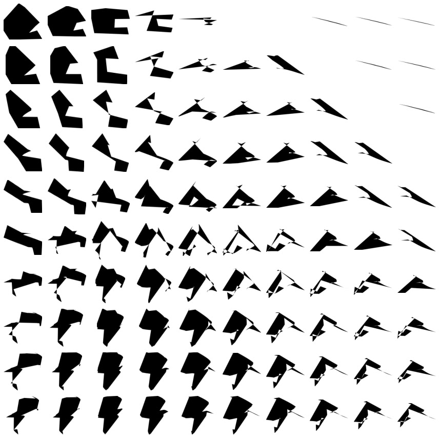

# LogoGen

My experements with generating vector graphics

### Vector representation
[converter](https://github.com/grafstor/LogoGen/tree/master/converter) - My svg to vector

### Generating
[pytorch_words2svg_2.py](https://github.com/grafstor/LogoGen/blob/master/pytorch_words2svg_2.py) - RNN \
[LogoGan](https://github.com/grafstor/LogoGen/blob/master/LogoGan.ipynb) - GAN \
[vae_2d](https://github.com/grafstor/LogoGen/blob/master/vae_2d.ipynb) - VAE \
[simple_diffusion_02](https://github.com/grafstor/LogoGen/blob/master/simple_diffusion_02.ipynb) - Denoising diffusion 

(all that doesn't work)

